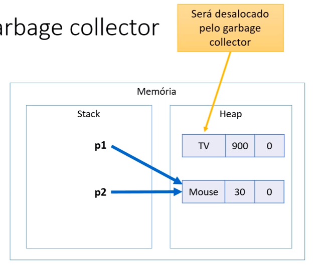

## Tipos referencia vs Tipo valor
- Em java, classes sao tipos referencia.
- Isso quer dizer que quando instanciamos a classe, seus atributos nao sao guardados na memoria stack, apenas teremos uma referencia para a memoria heap, e la teremos os atributos da classe armazenados.

```java
Product p1, p2; // criamos dois espacos na memoria stack
p1 = new Product("TV",900.00,0); // preenchemos o espaco da var p1 da memoria stack com um endereco que aponta para um espaco na memoria heap que contem os valores dos atributos da classe instanciada.
p2=p1; // preenchemos o espaco da var p2 da memoria stack com um endereco que aponta para o mesmo espaco na memoria heap que p1 esta apontando.
```


> Tipos referencia aceitam valor null, como `p2=null;`, neste caso a variavel ocuparia um espaco vazio na memoria sem apontar pra nada.

- Em java, tipos primitivos sao tipos valor. Eles ocupam espaco na memoria stack e nao sao ponteiros.
```java
double x, y; // cria dois espacos na memoria stack
x = 10; // preenchemos o espaco da var x da memoria stack com o valor 10
y = x; // preenchemos o espaco da var y da memoria stack com o valor 10 (COPIA, nao referencia)
```


> Tipos primitivos em java:


> E importante perceber que ao fazer `int p;` apenas estamos alocando um espaco na memoria, mas nao atribuindo um valor. A variavel so sera acessivel quando colocarmos um valor pra ela (inicializar), como `p= 0;`. Logo, tipos primitivos nao aceitam valores null.

## Valores Padrao
- Quando alocamos, usando `Product product = new Product();` atribuimos valores padrao ao seus elementos.
- numeros: valor 0.
- boolean: valor false.
- char: valor caracter 0.
- objeto: null


## Garbage collector
- Processo que automatica o gerenciamento de memoria do programa em execucao.
- Monitora os objetos alocados pelo programa na memoria HEAP (classes), desalocando os que nao estao sendo mais utilizados.
```java
Product p1, p2;
p1 = new Product("TV",900.00,0);
p2= new Product("Game",200.00,1);
p1=p2 // quando fazemos isso, o espaco na memoria heap ocupado pela classe p1 deixa de ser usado ja que agora ele aponta pro msm espaco que p2.
```


## Desalocacao por escopo
- para variaveis armazenadas na memoria stack, elas sao desalocadas imediatamente apos o escopo acabar.
- Ex. variaveis declaradas dentro de uma funcao ou um id.


> Dessa forma, se a referencia ainda existe, o que foi instanciado no heap nao sera eliminado. Ja para variaveis primitivas, se o escopo termina, ela deixa de existir.


## Vetor de Instancias
